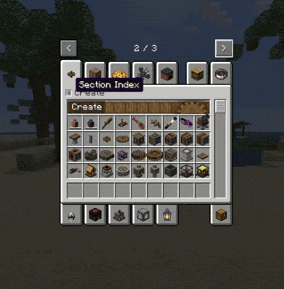
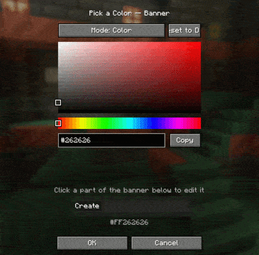
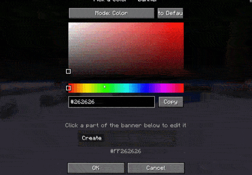

Create: Addon Organizer
=======

A NeoForge 1.21.1 mod that folds every Create addon's creative tab into
organized sections under the main "Create" tab, cutting down on the tab
clutter that comes with running several Create addons at once.

Works with  any other mod aswell!

Showcase
--------

**Section Index** (sidebar) — addon items are grouped into paginated sections nested
inside the "Create" tab, instead of each addon spawning its own tab in the
creative menu.

**Custom Section Colors** — each section's banner icon can be recolored
individually, making it easy to tell sections apart at a glance.

Links
-----

- [Issue Tracker](https://github.com/SockyWocky7/createaddonorganizer/issues) — found a bug or have a feature request? Report it here.
- [Discord](https://discord.gg/JEz2CkSaC) — join the community for support, update notifications, or if you want to share banner art!
- ☕ [Ko-fi](https://ko-fi.com/sockywocky7#payment-widget) — support development.

